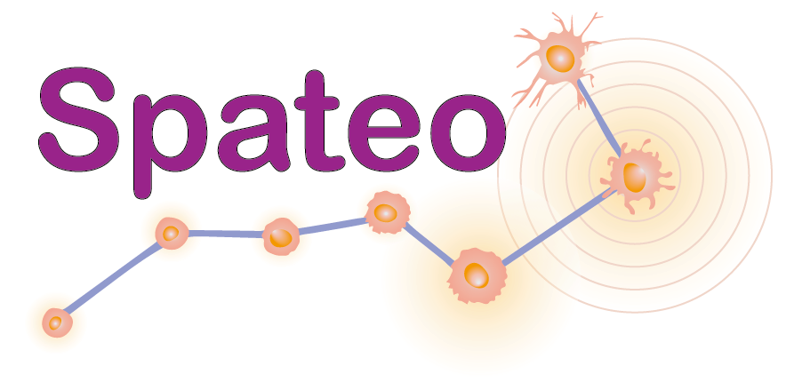

<div align="center">



# 🧬 Spateo-Skills

**Standardized, reusable skill modules for Spateo spatial transcriptomics analysis pipeline**

[](https://www.python.org/downloads/)
[](https://github.com/aristoteleo/spateo-release)
[](LICENSE)

📖 [Docs](docs/README.md) · 🌐 [中文](docs/README_CN.md) · 🧪 [Tests](tests/) · 🐛 [Issue Log](tests/GOTACH.md)

</div>

---

## 📋 About

Spateo-Skills converts notebook workflows into **callable, parameterized, CLI-runnable** Python modules. Each skill follows a consistent pattern:

```
Config (typed dataclass) → run_pipeline(config) → Result (typed dataclass)
```

✨ **Lazy imports** — importing a skill does not load Spateo  
✨ **Typed interfaces** — `@dataclass` Config/Result with defaults  
✨ **Composable** — each stage output feeds the next  
✨ **CLI-ready** — every skill runs standalone via `python -m`  
✨ **Agent-friendly** — predictable signatures, no magic, no side effects  

---

## 🚀 Quick Start

### 1️⃣ Install Environment

```bash
bash skills/00_env_setup/setup.sh   # auto-detects conda or uv
conda activate spateo_auto
```

### 2️⃣ Run Full Pipeline

```python
from skills.00_pipeline.run_all import PipelineConfig, run_full_pipeline

result = run_full_pipeline(PipelineConfig(
    data_path="./data/xenium_outs/",
    platform="xenium",
    stage2_path="./data/stage2.h5ad",
    out_dir="./output/",
))
```

### 3️⃣ Or Use Skills Individually

```python
import importlib

# 📖 Read — auto-detect platform
reader = importlib.import_module("skills.01_data_io.auto_read")
adata, platform = reader.read_auto_spatial_data("./data/unknown/", return_match=True)
adata.write_h5ad("./data/stage0.h5ad")

# 🔗 Align — two tissue slices
align = importlib.import_module("skills.02_slice_alignment.two_slice")
cfg = align.TwoSliceConfig(
    slice1_path="./data/slice_a.h5ad",
    slice2_path="./data/slice_b.h5ad",
    outdir="./output/alignment/",
)
r1 = align.run_two_slice_pipeline(cfg)

# 🏗️ Reconstruct — 3D point cloud + surface
recon = importlib.import_module("skills.03_3d_reconstruction.reconstruction")
cfg = recon.ReconstructionConfig(
    input_path="./data/aligned.h5ad",
    out_dir="./output/models/",
    models=["point-cloud", "surface"],
    groupby="tissue_type",
)
r2 = recon.run_reconstruction_pipeline(cfg)
# r2.point_cloud_model → VTK file path

# 🧭 Morphogenesis — cell migration vector field
vf = importlib.import_module("skills.04_morphogenesis.vectorfield")
cfg = vf.VectorFieldConfig(
    stage1_path="./data/stage1.h5ad",
    stage2_path="./data/stage2.h5ad",
    output_path="./output/morph/",
)
r3 = vf.run_vectorfield_pipeline(cfg)
# r3.saved_model_paths → list of VTK files
```

---

## 📦 Skill Index

| Stage | Skill | Module | Input | Output |
|---|---|---|---|---|
| 🔧 | **env_setup** | `skills.00_env_setup` | `setup.sh` | `spateo_auto` env |
| 📖 | **auto_read** | `skills.01_data_io.auto_read` | data directory | `AnnData` |
| 📖 | **manual_read** | `skills.01_data_io.manual_read` | platform + path | `AnnData` |
| 🔗 | **two_slice** | `skills.02_slice_alignment.two_slice` | two `.h5ad` | aligned `AnnData` |
| 🔗 | **multi_slice** | `skills.02_slice_alignment.multi_slice` | N× `.h5ad` | aligned `AnnData` |
| 🏗️ | **reconstruction** | `skills.03_3d_reconstruction.reconstruction` | aligned `.h5ad` | VTK models |
| 🎨 | **interpolation** | `skills.03_3d_reconstruction.interpolation` | `.h5ad` + VTK | expression-mapped mesh |
| 📐 | **morphology** | `skills.03_3d_reconstruction.morphology` | `.h5ad` + VTK | morphological metrics |
| 🧭 | **vectorfield** | `skills.04_morphogenesis.vectorfield` | two-stage `.h5ad` | vector field + models |
| 📊 | **feature** | `skills.04_morphogenesis.feature` | vectorfield `.h5ad` | GLM DEG tables |
| ▶️ | **run_all** | `skills.00_pipeline.run_all` | raw data | all outputs |

---

## 🔄 Pipeline Flow

```
📖 Stage 0 (IO)          🔗 Stage 1 (Alignment)        🏗️ Stage 2 (Reconstruction)
raw data ──→ AnnData      AnnData ──→ aligned AnnData   aligned AnnData ──→ VTK models
                │                        │                    ├── 🎨 interpolation
                auto_read                two_slice            ├── 📐 morphology
                manual_read              multi_slice          └── reconstruction
                                                                │
                                                                ↓
🧭 Stage 3 (Morphogenesis)
aligned AnnData + VTK model ──→ vector field
         │                            ├── 📊 feature (DEG)
         └── vectorfield              └── vectorfield
```

Inter-stage data format: **AnnData `.h5ad`** with alignment key stored in `.obsm`.

---

## 🎯 Supported Platforms

| Platform | Detect Signature |
|---|---|
| 🔬 MERFISH | `cell_by_gene.csv` + `cell_metadata.csv` |
| 🔬 Xenium | `cell_boundaries.csv` + `gene_panel.json` |
| 🔬 Visium | `spatial/scalefactors_json.json` |
| 🔬 Visium HD | `spatial/tissue_positions.parquet` |
| 🔬 Slide-seq | `MappedDGEForR.csv` |
| 🔬 Stereo-seq | `.gem` file |
| 🔬 STARmap+ | `processed_expression_pd.csv` |
| 🔬 seqFISH | `CxG` in filenames |
| 🔬 Open-ST | `.h5ad` file |

---

## 🧩 Skill Pattern

All skills share the same interface:

```python
from dataclasses import dataclass

@dataclass
class SkillConfig:
    """Typed parameters — everything has defaults."""
    input_path: str
    out_dir: str = "./output/"
    # ...

@dataclass
class SkillResult:
    """Typed outputs — paths as strings, notes for diagnostics."""
    output_dir: str
    notes: list[str]

def run_skill_pipeline(config: SkillConfig) -> SkillResult:
    """End-to-end entry point. Lazy-loads spateo on first call."""
```

### 🪶 Lazy Imports

No skill module loads spateo, torch, or pyvista at import time. Heavy deps are deferred to `run_*_pipeline()`. Safe for discovery and partial pipeline construction.

```python
import importlib
skill = importlib.import_module("skills.02_slice_alignment.two_slice")
# ✅ spateo not loaded yet
result = skill.run_two_slice_pipeline(cfg)
# ✅ spateo loads here
```

---

## ⚠️ Known Issues

| Issue | Stage | Status | Workaround |
|---|---|---|---|
| Surface mesh segfault (pymeshfix native lib) | 🏗️ 2 | 🟡 OPEN | `models=["point-cloud"]` only |
| Spateo `paste_pairwise_align` kwargs bug | 🧭 3 | 🟢 PATCHED | `patch_align_preprocess_kwarg()` auto-applied |
| No GPU (old CUDA driver) | all | 🟡 ENV | Runs on CPU (slower) |

---

## 📁 Project Structure

```
Spateo-Skills/
├── skills/
│   ├── 00_shared/          # lazy_imports, data_helpers, configure_logging
│   ├── 00_env_setup/       # setup.sh, environment.yml, uv_requirements.txt
│   ├── 00_pipeline/        # run_all.py — full pipeline orchestrator
│   ├── 01_data_io/         # auto_read.py, manual_read.py
│   ├── 02_slice_alignment/ # two_slice.py, multi_slice.py, two_stage_3d.py
│   ├── 03_3d_reconstruction/ # reconstruction.py, interpolation.py, morphology.py
│   └── 04_morphogenesis/   # vectorfield.py, feature.py
├── docs/                   # PYTHON-PATTERNS.md, CODEMAP.md
├── tests/                  # GOTACH.md (issue log)
└── pyproject.toml
```

---

## 📚 Development

- 🌐 中文版 → [`docs/README_CN.md`](docs/README_CN.md)
- 📖 Coding standards → [`docs/README.md`](docs/README.md)
- 🗺️ File index → [`docs/architecture/CODEMAP.md`](docs/architecture/CODEMAP.md)
- 🧪 Test results → [`tests/GOTACH.md`](tests/GOTACH.md)

---

<div align="center">

Made with ❤️ for spatial transcriptomics

</div>
